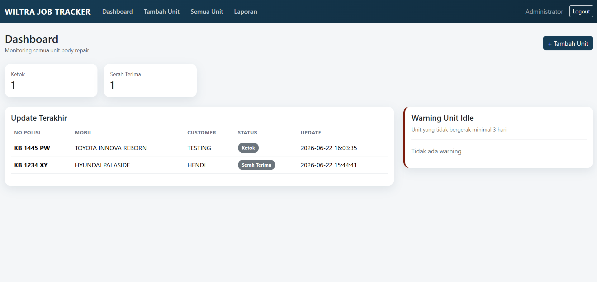

# Wiltra Job Tracker

Internal management system for body repair workshop operations.

## Overview

A custom web-based system built to manage the full body repair workflow, from vehicle intake to final delivery.

## Screenshots

## Key Features

- Vehicle registration
- Repair status tracking
- Idle unit monitoring
- Photo documentation
- COGS reporting
- PDF export
- Excel export

## Tech Stack

- PHP
- MySQL
- HTML
- CSS
- Bootstrap
- JavaScript

## Note

This repository is for portfolio showcase only. Source code is private.
